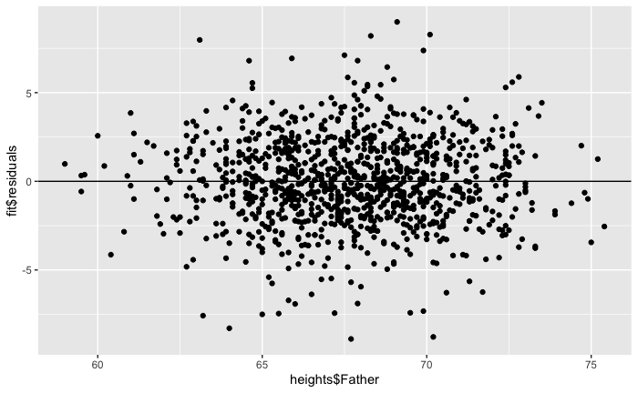

Linear regression: theory and assumptions
==========================================

## Regression toward the mean
Francis Galton (Darwin's half-cousin) was a biologist interested in evolution, and one of the main proponents of eugenics (he coined the term himself). To advance his research program, he set out to measure several features in human populations, and started trying to explain the variation he observed, incidentally becoming one of the founding fathers of modern statistics. 

In his "Regression towards mediocrity in hereditary stature" he showed an interesting pattern: children of tall parents tended to be shorter than their parents, while children of short parents tended to be taller than their parents. He called this phenomoenon "regression toward mediocrity" (now called regression toward [to] the mean). 

We're going to explore this phenomenon using Karl Pearson's (another founding father of statistics) data from 1903, recording the height of fathers and sons:

![Galton's fathers and sons data[]{data-label="Heights of Fathers and Sons"}](images/Galton_regression.png)

You can see that the line does not divide the cloud of points evenly: even though tall fathers tend to produce tall sons, and short fathers short sons, the sons of short fathers tend to be taller than their fathers (for example, look at the sons of fathers less than 60 inches tall), while the sons of tall fathers tend to be shorter than their fathers (for example, the sons of fathers taller than 75 inches).

This phenomenon is called "regression toward the mean": when you take two measurement on the same sample (or related samples, as here), if a variable is extreme on its first measurement, it will tend to be closer to the average on its second measurement; if it is extreme on its second measurement, it will tend to have been closer to the average on its first. 

### Regression to the mean: dangers of interpretation

- A city sees an unusual growth of crime in a given neighborhood, and they decide to patrol the neighborhood more heavily. The next year, crime rates are close to normal. Was this due to heavy presence of police?
- A teacher sees that scolding students who've had a very low score in a test makes them perform better in the next test. (But would praising those with unusually high scores lead to slacking off in the next test?)
- A huge problem in science: effect sizes tend to decrease through time. Problem of selective reporting?

This phenomemon gave the name to one of the simplest statistical models: the linear regression.

## Least squares line
How can we explain the relationship between the height of the faters and those of their sons? One of the simplest models we can use is called a "Linear Model". Basically, we want to express the height of the son as a function of the height of the father:
$$
y_i = \beta_0 + \beta_1 x_i + \epsilon_i
$$
where $y_i$ is the height of the son (**response variable**), $x_i$ is the height of the father (**explanatory variable**), $\beta_0$ and $\beta_1$ are two numbers (intercept and slope of the line) that do not vary within the population (these are the parameters we want to fit). Finally, the term $\epsilon_i$ measures the "error" we are making for the $i^{th}$ son. For simplicity, we assume the $\epsilon_i \overset{\text{iid}}{\sim} \mathcal N(0, \sigma^2)$ (and $\sigma$ is therefore another parameter we want to fit).

When we have multiple explanatory variables (for example, if we had recorded also the height of the mother, whether the son was born at full term or premature, the average caloric intake for the family, etc.), we speak of **Multiple Linear Regression**:

$$
y_i = \beta_0 + \sum_{k=1}^n \beta_k x_{ik} + \epsilon_i
$$

### Solving for the parameters using linear algebra

In this section, we're going to look at the mechanics of linear regression. Suppose that for simplicity we have a single explanatory variable, then we can write the linear model in compact form as:
$$
\mathbf{Y} = \mathbf{X} \mathbf{\beta} + \mathbf{\epsilon}
$$
where:
$$
\mathbf{Y} = \begin{pmatrix} y_1\\ y_2\\ \vdots \\ y_n \end{pmatrix} \;\;\; 
\mathbf{X} = \begin{pmatrix} 1 & x_1\\ 1 & x_2\\ \vdots & \vdots \\ 1 & x_n \end{pmatrix}
 \;\;\; 
\mathbf{\beta} = \begin{pmatrix} \beta_0 \\ \beta_1\end{pmatrix} \;\;\; \mathbf{\epsilon} = \begin{pmatrix} \epsilon_1 \\ \epsilon_2 \\ \vdots \\ \epsilon_n \end{pmatrix}
$$

Solving the linear regression means finding the best-fitting $\beta_0$, $\beta_1$ and $\sigma$ (controlling the spread of the distribution of the $\epsilon_i$). Our goal is to find the values of $\beta$ that minimize $\sigma$ (meaning that the points fall closer to the line). Rearranging:
$$
\sum_i \epsilon_i^2 = \sum_i (y_i - \beta_0 - \beta_1 x_i)^2 =  \Vert \mathbf{Y} - \mathbf{X} \mathbf{\beta} \Vert
$$

As such, we want to find the vector $\beta$ that minimizes the norm $\Vert \mathbf{Y} - \mathbf{X} \mathbf{\beta} \Vert$. One can prove that this is accomplished using:
$$
\hat{\mathbf{\beta}} = \left( \mathbf{X}^T \mathbf{X} \right)^{-1} \mathbf{X}^T \mathbf{Y}
$$

Where the matrix $\left( \mathbf{X}^T \mathbf{X} \right)^{-1} \mathbf{X}^T$ is known as the (left) Moore-Penrose pseudo-inverse of $\mathbf{X}$. 

### Minimizing the sum of squares
What we just did is called "ordinary least-squares": we are trying to minimize the distance from the data points to their projection on the best-fitting line. We can compute the "predicted" heights as:
$$
\hat{\mathbf{Y}} = \mathbf{X}\hat{\mathbf{\beta}}
$$
Then, we're minimizing $\Vert \mathbf{Y} - \hat{\mathbf{Y}}\Vert$. We call $\hat{\mathbf{\epsilon}} = \mathbf{Y} - \hat{\mathbf{Y}}$ the vector of **residuals**. From this, we can estimate the final parameter, $\sigma$:

$$
\sigma = \sqrt{\frac{\sum_i \hat{\epsilon_i}^2}{n -  p}}
$$
where $n$ is the number of data points, and $p$ is the number of parameters in $\mathbf{\beta}$ (2 in this case); this measures the number of **degrees of freedom**.

## Correlation and interpretation

ne essential measure of the quality of linear regression is correlation, which is a measure of how much variation in one random variable corresponds to variation in the other. If this sounds very similar to the description of covariance, it's because they are closely related. Essentially, correlation is a ``normalized'' covariance, made to range between -1 and 1. Here is the definition:

>The (linear or Pearson) correlation of a dataset of pairs of data values $(X,Y)$ is:
$$ r = \frac{Cov(X,Y)}{\sqrt{Var(X)Var(Y)}} =  \frac{Cov(X,Y)}{\sigma_X \sigma_Y}$$

If the two variables are identical, $X=Y$, then the covariance becomes its variance $Cov(X,Y) = Var(X)$ and the denominator also becomes the variance, and the correlation is 1. This is also true if $X$ and $Y$ are scalar multiples of each other, as you can see by plugging in $X= cY$ into the covariance formula. The opposite case if $X$ and $Y$ are diametrically opposite, $X = -cY$, which has the correlation coefficient of -1. All other cases fall in the middle, neither perfect correlation nor perfect anti-correlation. The special case if the two variables are independent, and thus their covariance is zero, has the correlation coefficient of 0.

This gives a connection between correlation and slope of linear regression:
$$
m = r \frac{\sigma_Y}{\sigma_X}
$$

Whenever linear regression is reported, one always sees the values of correlation $r$ and squared correlation $r^2$ displayed. The reason for this is that $r^2$ has the meaning: **the fraction of the variance of the dependent variable $Y$ explained by the linear regression $Y=mX+b$.** 

There are, as usual, a couple of cautions about relying on the correlation coefficient First, just because there is no linear relationship, does not mean that there is no other relationship. Figure above shows some examples of scatterplots and their corresponding correlation coefficients. What it shows is that while a formless blob of a scatterplot will certainly have zero correlation, so will other scatterplots in which there is a definite relationship (e.g. a circle, or a X-shape). The point is that correlation is always a measure of the linear relationship between variables.

The second cautionary tale is well known, as that is the danger of  equating correlation with a causal relationship. There are numerous examples of scientists misinterpreting a coincidental correlation as meaningful, or deeming two variables that have a common source as causing one another. It cannot be repeated often enough that one must be careful when interpreting correlation: a weak one does not mean there is no relationship, and a strong one does not mean that one variable causes the variation in the other.

## Assumptions of linear regression
In practice, when we are performing a linear regression, we are making a number of assumptions about the data. Here are the main ones:

* Model structure: we assume that the process generating the data is linear.
* Explanatory variable: we assume that this is measured without errors (!).
* Residuals: we assume that residuals are i.i.d. Normal.
* Strict exogeneity: the residuals should have conditional mean of 0. 

$$
\mathbb E[\epsilon_i | x_i] = 0
$$

* No linear dependence: the columns of $\mathbf{X}$ should be linearly independent.
* Homoscedasticity: the variance of the residuals is independent of $x_i$.

$$
\mathbb V[\epsilon_i | x_i] =  \sigma^2
$$

* Errors are uncorrelated between observations. 
$$
\mathbb E[\epsilon_i \epsilon_j | x] = 0 \; \forall j \neq i
$$

These assumptions are primarily concerned with the distribution of the residuals, which are the parts of the data that are unexplained by the linear model. For example, the residuals of the Galton father-son data set look like this:

